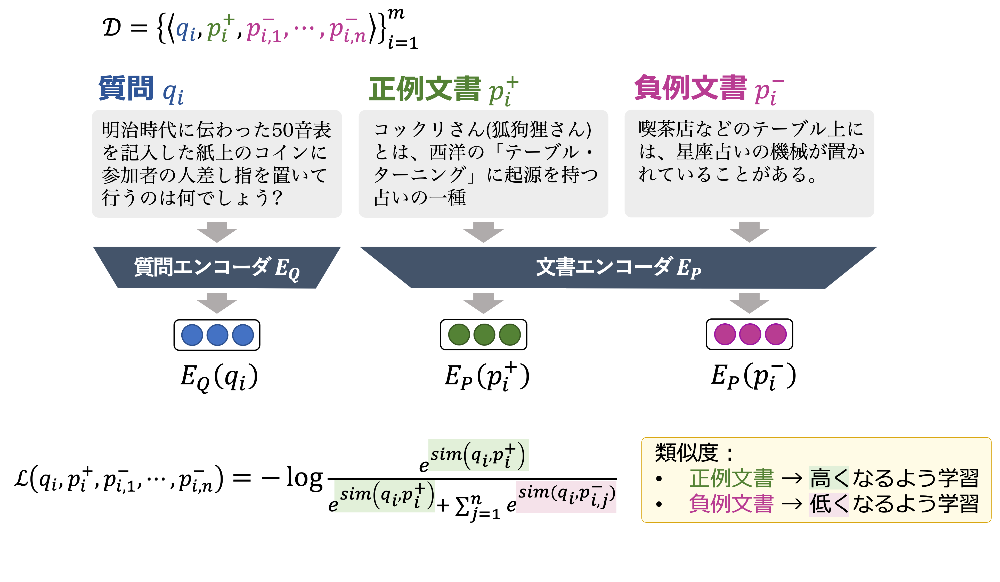

# Dense Passage Retrieval (DPR)



本節では Dense Passage Retrieval (DPR) の学習手順、および DPR による文書エンベディングの作成について紹介します。<br>
学習したDPRによる質問への関連文書検索方法については、[AIO3_FiD_baseline/README.md #データセットの質問に関連する文書の抽出](../../README.md#データセットの質問に関連する文書の抽出) をご参照ください。

### 学習データ
- Retriever (Dense Passage Retrieval) の訓練データには、クイズ大会[「abc/EQIDEN」](http://abc-dive.com/questions/) の過去問題に対して Wikipedia の記事段落の付与を自動で行ったものを使用しています。
- また、開発・評価用クイズ問題には、[株式会社キュービック](http://www.qbik.co.jp/) および [クイズ法人カプリティオ](http://capriccio.tokyo/) へ依頼して作成されたものを使用しています。

- 以上のデータセットの詳細については、[AI王 〜クイズAI日本一決定戦〜](https://www.nlp.ecei.tohoku.ac.jp/projects/aio/) の公式サイト、および下記論文をご覧下さい。

> __JAQKET: クイズを題材にした日本語QAデータセット__
> - https://www.nlp.ecei.tohoku.ac.jp/projects/jaqket/
> - 鈴木正敏, 鈴木潤, 松田耕史, ⻄田京介, 井之上直也. JAQKET:クイズを題材にした日本語QAデータセットの構築. 言語処理学会第26回年次大会(NLP2020) [\[PDF\]](https://www.anlp.jp/proceedings/annual_meeting/2020/pdf_dir/P2-24.pdf)


<br>

### ダウンロード
第三回AI王コンペティションで配布されている訓練・開発・リーダーボード評価用セット、およびRetriever (Dense Passage Retrieval) の学習で使用するデータセット（訓練・開発用クイズ問題に Wikipedia の記事段落の付与を行ったもの）は、下記のコマンドにより取得することができます。
<br>

```bash
$ datasets_dir="datasets"
$ bash scripts/download_data.sh $datasets_dir

<datasets_dir>
|- aio_02_train.jsonl              # 第三回訓練セット
|- aio_02_dev_v1.0.jsonl           # 第三回開発セット
|- aio_03_test_unlabeled.jsonl     # 第三回リーダーボード評価セット
|- wiki/
|  |- jawiki-20220404-c400-large.tsv.gz  # Wikipedia 文書集合
|- retriever/
|  |- aio_02_train.json.gz         # 第三回訓練セットに Wikipedia の記事段落の付与を行ったもの
|  |- aio_02_dev.json.gz           # 第三回開発セットに Wikipedia の記事段落の付与を行ったもの

# 「質問」と「正解」からなる TSV 形式のファイル
|  |- aio_02_train.tsv
|  |- aio_02_dev.tsv
```


第三回AI王クイズ問題

| データ             |ファイル名|質問数|       文書数 |
|:----------------|:---|---:|----------:|
| 訓練              |aio\_02\_train|22,335|         - |
| 開発              |aio\_02\_dev\_v1.0|1,000|         - |
| リーダーボード投稿用評価データ |aio\_03\_test\_unlabeled|1,000|         - |
|文書集合|jawiki-20220404-c400-large|-| 4,288,199 |

- データセットの構築方法の詳細については、[data/README.md](data/README.md)を参照して下さい。

#### 形式

以下の例に示した要素からなるリスト型の JSON ファイル
- `question`：質問
- `answers`：答えのリスト
- `positive_ctxs`：正例文書（答えを含む文書）。以下の辞書で構成されたリスト形式。
    - `id`：文書インデックス
    - `title`：Wikipedia のタイトル
    - `text`：Wikipedia の記事
- `negative_ctxs`：負例文書（インバッチネガティブ：ミニバッチ内の他の質問に対する正例文書）。学習中に定義される。
- `hard_negative_ctxs`: ハード負例文書（質問に類似するが答えを含まない文書。）。`positive_ctxs` と同様の形式。

```json
{
    "question": "明治時代に西洋から伝わった「テーブル・ターニング」に起源を持つ占いの一種で、50音表などを記入した紙を置き、参加者全員の人差し指をコインに置いて行うのは何でしょう?",
    "answers": [
        "コックリさん"
    ],
    "positive_ctxs": [
        {
            "id": 278397,
            "title": "コックリさん",
            "text": "コックリさん(狐狗狸さん)とは、西洋の「テーブル・ターニング(Table-turning)」に起源を持つ占いの一種。机に乗せた人の手がひとりでに動く現象は心霊現象だと古くから信じられていた。科学的には意識に関係なく体が動くオートマティスムの一種と見られている。「コックリさん」と呼ばれるようになったものは、日本で19世紀末から流行したものだが、これは「ウィジャボード」という名前の製品が発売されたりした海外での流行と同時期で、外国船員を通して伝わったという話がある。"
        }
    ],
    "negative_ctxs": [],
    "hard_negative_ctxs": [
        {
            "id": 3943003,
            "title": "星座占い",
            "text": "喫茶店などのテーブル上には、星座占いの機械が置かれていることがある。硬貨を投入して、レバーを動かすと、占いの内容が印刷された用紙が排出される。"
        },
    ]
}
```

### 文書集合（Wikipedia）

- 以下のアイテムで構成される TSV 形式のデータ（2022.04.04 時点のものを使用）
    - `id`：文書インデックス
    - `text`：Wikipedia の記事
    - `title`：Wikipedia のタイトル

```tsv
id      text    title
1       "アンパサンド(&, 英語: ampersand)は、並立助詞「...と...」を意味する記号である。ラテン語で「...と...」を表す接続詞 ""et"" の合字を起源とする。現代のフォントでも、Trebuchet MS など一部のフォントでは、""et"" の合字であることが容易にわかる字形を使用している。"  アンパサンド
```


### 環境構築
- まず、Dockerコンテナを起動します。
```bash
# コマンド実行例
$ docker image build --tag aio3_fid:dpr .
$ docker container run \
      --name train_dpr \
      --rm \
      --interactive \
      --tty \
      --gpus all \
      --mount type=bind,src=$(pwd),dst=/app/retrievers/AIO3_DPR \
      aio3_fid:dpr \
      bash
```
- cuda バージョンに合わせて、以下より torch v1.9.1 をインストールして下さい。
  - https://pytorch.org


### 設定

```bash
$ cd retrievers/AIO3_DPR
$ vim scripts/configs/config.pth
```

- 実装を始める前に、上記設定ファイルに以下の項目を設定して下さい。
    - `WIKI_FILE`：Wikipedia の文書ファイル
    - `TRAIN_FILE`：訓練セット
    - `DEV_FILE`：開発セット
    - `TEST_FILE`：評価セット
    - `DIR_DPR`：モデルやエンベッディングが保存されているディレクトリへのパス


#### 1. BiEncoder の学習
質問と文書の類似度を計算するため、質問エンコーダおよび文書エンコーダで構成される BiEncoder を学習します。
- [scripts/retriever/train_retriever.sh](scripts/retriever/train_retriever.sh)

```bash
# 実行例

$ exp_name="baseline"
$ config_file="scripts/configs/retriever_base.json"

$ bash scripts/retriever/train_retriever.sh \
    -n $exp_name \
    -c $config_file

# 実行結果

$ ls $DIR_DPR/$exp_name/retriever
    dpr_biencoder.*.*.pt            # モデルファイル
    hps.json                        # パラメータ
    score_train_retriever_*.jsonl   # 訓練時スコアログ
    logs/
      run_*.sh                      # 実行時シェルスクリプト
      train_*.log                   # 実行時ログ
    tensorboard/                    # tensorboard ログディレクトリ (if `--tensorboard_logdir`)
```

#### 2. 文書集合のエンコード
質問と文書の類似度を計算する前に、文書集合（Wikipedia）を文書エンコーダでエンコードします。
- [AIO3_DPR/scripts/retriever/encode_ctxs.sh](scripts/retriever/encode_ctxs.sh)

```bash
# 実行例

$ exp_name="baseline"
$ model_file="path/to/model"

$ bash scripts/retriever/encode_ctxs.sh \
    -n $exp_name \
    -m $model

# 実行結果

$ ls $DIR_DPR/$exp_name/embeddings
    emb_${model}.pickle             # 文書エンベッディング
    logs/
      embs_*.log                    # 実行時ログ
```

- `biencoder.pt`:
    - biencoder の訓練済みファイル
- `embedding.pickle`:
    - 文書エンベッディングファイル
